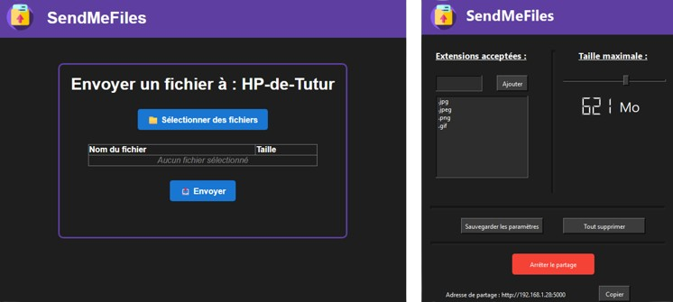

# SendMeFiles

<h3>Here is the code for SendMeFiles, a simple but complete application to send files to a computer on the same network with Python.</h3>
<br>

<div align="center">
    
</div>
<br>

<hr style="height:2px; background-color:gray; border:none;">
<br>

<h4>First stage :</h4>
To install the dependencies, you'll need to run one command depending the system you have. Don't hesitate to create a venv if you need.
First, with your terminal, navigate to the directory which contains the file <code>requirements.txt</code> :
<br><br>
Then, run this command :
<br><br>
Windows / Linux :

```shell
pip install -r requirements.txt
```
MacOS :
```shell
pip3 install -r requirements.txt
```
<br>

<hr style="height:2px; background-color:gray; border:none;">
<br>

<h4>Second stage :</h4>
Run the script <code>SendMeFiles_UI.py</code>. Change the settings to accept only a few file types or to define a size limit for files. Start the sharing and share the sharing link with other people on the same network to receive files.
<br><br>
